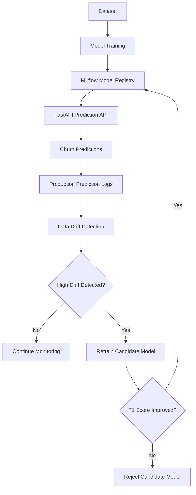

# ChurnGuard — End-to-End MLOps

ChurnGuard is an end-to-end machine learning project for predicting customer churn, featuring model deployment, data drift monitoring, and automated retraining.

## Features

- Trained and compared Logistic Regression, Random Forest, and XGBoost.
- Used MLflow for experiment tracking and model registration.
- Built a prediction API using FastAPI.
- Implemented PSI-based data drift detection.
- Automated retraining with F1-based model promotion.
- Developed an interactive Streamlit dashboard.
- Containerized services using Docker and Docker Compose.
- Automated testing and Docker builds using GitHub Actions.

## Tech Stack

**Python | Scikit-learn | XGBoost | MLflow | FastAPI | Streamlit | Docker | Pytest | GitHub Actions**

## Model Performance

Logistic Regression was selected based on its F1 score.

| Metric | Score |
|---|---:|
| Accuracy | 77.79% |
| Precision | 56.95% |
| Recall | 66.84% |
| F1 Score | 61.50% |
| ROC-AUC | 84.19% |

## Architecture

## Architecture

## Testing and CI

- **Test coverage:** 99%
- **CI/CD:** GitHub Actions workflow passing

